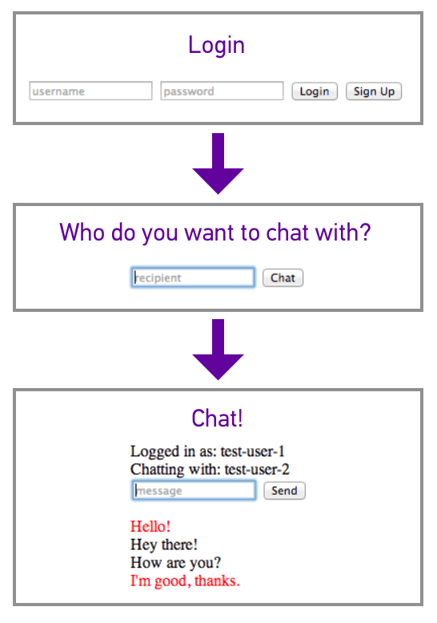

# Use the Sinch Javascript SDK to Build a Messaging App

In this tutorial, you will build a bare bones instant messaging web app. You will gain a solid understanding of how to use the Sinch Javascript SDK for messaging, as well a starting place for building a highly customized instant messaging solution in your web app.

Your app will work like this:

First, users will either login or sign up. Then, they will be prompted to type the username of the person they want to chat with. Finally, they enter a chat room with the specified recipient.

If you get stuck at any point, you can view the completed source code for this tutorial at [github.com/sinch/js-messaging-tutorial](https://github.com/sinch/js-messaging-tutorial)

## Setup

Start by creating a few empty files to work in:

*   index.html
*   index.js

In the **index.html** header, include jquery:

	

Also add a script tag after the closing body tag that runs **index.js**:

	

Lastly, you will need to set up the Sinch SDK. Download it from [www.sinch.com/js-sdk](http://www.sinch.com/js-sdk). Inside the main folder, you will find **sinch.min.js**. Move this file into the root of your project directory, and include it in the head of **index.html**:

	
	
To generate an app key and secret, you need to sign up for a Sinch account at [www.sinch.com/signup](http://www.sinch.com/dashboard/#/signup). Once you are logged into your developer dashboard, click **Apps** on the left-hand side, then click the purple **Create New App** button on the right.

You will be prompted to name your app, along with some other fields. You only need to name your app (anything you want), and click **Create**.

For this tutorial, you will only need your app key. You can get that by clicking on the keys icon to the right of the name of your app.

## Signup and Login

The first thing your users should see is a signup/login form. Begin by defining this in **index.html**:

	

	<form>
	<input id="username" placeholder="username">
	<input id="password" type="password" placeholder="password">
	<button id="loginUser">Login</button>
	<button id="createUser">Sign Up</button>
	</form> 
	

Here is some pseudocode to give you an idea of what the login with Sinch will look like in **index.js**:

	var global_username = '';
	var global_recipient = '';

	//start an instance of SinchClient

	$('button#createUser').on('click', function(event) {
	//don't submit the form (preventDefault)
	//disable buttons while logging in user  
	//get username & password from form

	//register new user with sinchClient
	//success: login user
	//success: prompt to pick recipient
	//fail: display error message
	//fail: display error message

	});

	$('button#loginUser').on('click', function(event) {
	//don't submit the form (preventDefault)
	//disable buttons while logging in user  
	//get username & password from form

	//login user
	//success: prompt to pick recipient
	//fail: display error message
	});

To start an instance of SinchClient, use your application key, and specify that your app will be using the messaging feature:

	sinchClient = new SinchClient({
	applicationKey: 'your-app-key',
	capabilities: {messaging: true},
	});

You will start the sinchClient when logging in a user. First though, you need to handle a user that wants to sign up. The following code snippet will prevent the form from being submitted, disable signup/login buttons while signing up/logging in a user, and get the username and password from the form fields. You can use this in button#createUser click and button#loginUser click:

	event.preventDefault();
	$('button#createUser').attr('disabled', true);
	$('button#loginUser').attr('disabled', true);

Then, get the user's username and password from the signup/login form:

	var username = $('input#username').val();
	var password = $('input#password').val();

To register a new user with your app, use:

	var loginObject = {username: username, password: password};
	sinchClient.newUser(loginObject, function(ticket) {
	//On success, login user   
	}).fail(handleError);

For now, just create an empty handleError function. I'll cover this in the next section:

	var handleError = function(error) {}

To log a user into your app (use this in button#createUser and button#loginUser):

	sinchClient.start({username: username, password: password}, function() {
	global_username = username;
	console.log("Logged in!");
	}).fail(handleError);

Try signing up and logging in now to make sure that both buttons produce a "Logged in!" in the console.

Note: To keep this tutorial simple, this app has no concept of user sessions. To logout, just reload the page.

##Handle and Display Errors

If there is an error when logging in, signing up, or sending a message, you will want to display the error message. In **index.html**, create an empty div to display error messages:

	

In **handleError**, you should enable the signup/login buttons (because they get disabled in button#createUser and button#loginUser), and display the error message from your sinchClient:

	$('button#createUser').attr('disabled', false);
	$('button#loginUser').attr('disabled', false);
	$('div.error').text(error.message);

To test displaying errors, the easiest thing to do is to try logging in as a user that doesn't exist. You should see the error "40108 Invalid Credentials" displayed in your error div. Now that your app can display errors, you should also have a method to clear the error div:

	var clearError = function() {
	$('div.error').text("");
	}

You'll want to call clearError at the beginning of button#createUser click and button#loginUser click.

##Pick Recipient

Upon a successful authentication, your app should hide div#auth, and display a form to submit the username of the person you want to chat with. Create this form (which should be hidden by default) in **index.html** below div#auth:

	<form id="pickRecipient" style="display:none;">
	<input id="recipient" placeholder="recipient">
	<button id="pickRecipient">Chat</button>
	</form>

To handle the hiding and showing of divs upon login, define showPickRecipient:

	var showPickRecipient = function() {
	$('div#auth').css('display', 'none');
	$('form#pickRecipient').show();
	}

And call showPickRecipient in both places where a user is logged in! Here is the completed code for button#createUser click and button#loginUser click:

	$('button#createUser').on('click', function(event) {
	event.preventDefault();
	$('button#createUser').attr('disabled', true);
	$('button#loginUser').attr('disabled', true);
	clearError();

	var username = $('input#username').val();
	var password = $('input#password').val();

	var loginObject = {username: username, password: password};
	sinchClient.newUser(loginObject, function(ticket) {
	sinchClient.start(ticket, function() {
	global_username = username;
	showPickRecipient();
	}).fail(handleError);
	}).fail(handleError);
	});

	$('button#loginUser').on('click', function(event) {
	event.preventDefault();
	$('button#createUser').attr('disabled', true);
	$('button#loginUser').attr('disabled', true);
	clearError();

	var username = $('input#username').val();
	var password = $('input#password').val();

	var loginObject = {username: username, password: password};
	sinchClient.start(loginObject, function() {
	global_username = username;
	showPickRecipient();
	}).fail(handleError);
	});

Now that the pick recipient form is being shown, you should listen for a click on the submit button:

	$('button#pickRecipient').on('click', function(event) {
	event.preventDefault();
	clearError();
	global_recipient = $('input#recipient').val();
	//show the chat room!
	});

Here is the html for the chat room (which, like form#pickRecipient, should be hidden by default). It displays the current user info, the recipient's username, a form to send a message, and an empty div that you will append messages to:

	

	

	Logged in as:  
	Chatting with: 
	

	<form id="newMessage">
	<input id="message" placeholder="message">
	<button id="sendMsg">Send</button>
	</form>

	

	

To show the chat room and hide form#pickRecipient, define showChat:

	var showChat = function() {
	$('form#pickRecipient').css('display', 'none');
	$('div#chat').show();
	//Fill the username and recipient "info text" with
	//the current user and recipient
	$('span#username').text(global_username);
	$('span#recipient').text(global_recipient);
	}

Now you can call showChat when the pickRecipient button is clicked.

##Send Messages

You made it to the fun part - sending messages! First, you should listen for a click on the sendMessage button:

	$('button#sendMsg').on('click', function(event) {
	//don't submit the form
	event.preventDefault();

	//clear any errors that from the auth process
	clearError();
	});

Inside the above method, you will also want to:

1.  Get the message from the form input box.
2.  Clear the input box (makes it easy for the user to send the next message)
3.  Create a message with the sinch message client
4.  Use the sinch message client to send the message

	//global variable
	var messageClient = sinchClient.getMessageClient();

	var text = $('input#message').val();
	$('input#message').val('');
	var sinchMessage = messageClient.newMessage(global_recipient, text);
	messageClient.send(sinchMessage).fail(handleError);

Your app is ready to send messages! A few things that I should explain now - First, your app has no concept of user sessions right now, so you can be logged in as two different users in two different browser tabs. This makes testing quite easy! Second, you haven't yet written a way for your app to display the sent messages in the chat room, so don't be alarmed when you send a message and don't see any visual difference. I'll explain why in the next section.

##Listen for Incoming Messages

In this section, you will learn how to add an event listener to messageClient to listen for incoming messages. The cool thing about the Sinch Javascript SDK is that for every message you send to a friend, you also send a copy of that message to yourself. That way, onIncomingMessage gets called once for every message you send and receive. To set up the skeleton of this event listener and add it the the message client:

	var eventListener = {
	onIncomingMessage: function(message) {}        
	}

	messageClient.addEventListener(eventListener);

Pretty simple, right? To display messages in onIncomingMessage, append a div with the message to the empty chat area div you created earlier in this tutorial.

	$('div#chatArea').append('
' + message.textBody + '
');

Now, you can log in to the messaging app as two different users in two different browser tabs and talk to each other! Unfortunately, your app doesn't yet have any visual difference between incoming and outgoing messages. You can set a text color on the message div depending on whether or not the sender id is equal to global_username:

	if (message.senderId == global_username) {
	//outgoing
	$('div#chatArea').append('
' + message.textBody + '
');
	} else {
	//incoming
	$('div#chatArea').append('
' 
	            + message.textBody + '
');
	}

You're all done! Hopefully this tutorial gives you a good starting point for whatever exciting messaging app you are building. Build something neat? Share with us on Twitter [@SinchDev](http://www.twitter.com/sinchdev), or email us at [hi@sinch.com](mailto:hi@sinch.com)
